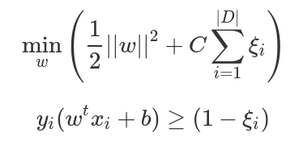
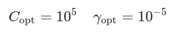
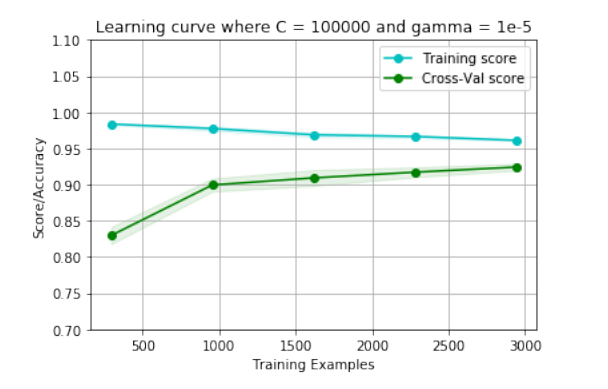

<h1 align=center style=\"color: #005496; font-size: 4.2em;\">University of Trento</h1>
<h2 align=center>Assignment on Sklearn, Support Vector Machines</h2>
<h3 align=center>Machine Learning Course, Prof. Andrea Passerini - A.Y. 2019/2020</h3>
<h4 align=center>Giuseppe Saccardi</h4>

## ***spambase*** dataset
The Spambase data set was created by Mark Hopkins, Erik Reeber, George
Forman, and Jaap Suermondt at Hewlett-Packard Labs. It includes 4601 observations corresponding to email messages, 1813 of which are spam. 
From the original email messages, 58 different attributes were computed, with the most
relevant one for our next purposes is nominal, namely a value that can be either
1 or 0, respectively the class attribute of type spam or not. These attributes
are in separate files as target labels.
The task we wish to overcame is to classify whether an email is spam or not.
```python
import numpy as np
# Now we need to load the data we are going to deal with, namely those 
# refering to the Spambase dataset
# Loading data and storing them as training/ test data and training/test targets
test_data = np.loadtxt("test-data.csv",delimiter=",")
train_data = np.loadtxt("train-data.csv",delimiter=",")
test_targets = np.loadtxt("test-targets.csv",delimiter=",")
train_targets = np.loadtxt("train-targets.csv",delimiter=",")
# Here some manipulations are needed in order to deal with suitable format arrays
test_targets = test_targets.ravel()
test_targets = np.array(test_targets).astype(int)
train_targets = train_targets.ravel()
train_targets = np.array(train_targets).astype(int)
```

### Data
More info about data format can be found in the files: **spambase.DOCUMENTATION**, **spambase.names**
NOTE: spambase.DOCUMENTATION, refers to the original data configuration, 
we have already moved data and targets in separate files


### Targets

spam : int
    1: spam
    0: not spam
    
## Classifier and implemented methods
For almost every classification problem, and more generally for all well-posed
problem that can be solved using machine learning algorithm, we have to train the classifier on a subset of the original dataset, namely the training set, and then evaluate it in
according to a performance measure on a separate subset of the dataset: test
set.
We used the Soft Margin Classifier since although it could produce mis-classified
examples, it has some good generalization properties.
As we saw during the course, it is a maximization problem regarding the margin in
the training examples with a regularization terms that can be formalized as a
minimization problem where
 

## On the research of the best hyper-parameters C and gamma
Once the classifier has been chosen, it is possible and recommended to search the hyper-parameter space for the best cross validation score.
For our purposes we used the **GridSearchCV** that exhaustively considers all parameter combinations given as input, and performs for all possible combinations a k-folds cross validation using the accuracy as evaluation measure.
```python
import sklearn
from sklearn.svm import SVC
from sklearn import metrics
from sklearn.model_selection import KFold, cross_val_score
from sklearn.model_selection import learning_curve

try:
    from sklearn.model_selection import GridSearchCV
except ImportError:
    from sklearn.grid_search import GridSearchCV
try: 
    from sklearn.model_selection import KFold, cross_val_score
    legacy = False 
except ImportError:
    from sklearn.cross_validation import KFold, cross_val_score
    legacy = True
```
The possible parameters we gave it as input are collected in the following dictionary
```python
# The classifier we wish to adopt is the SVC with "rbf" kernel performing the GridSearchCV()
# Hence we declare some possible parameters in order to go through a preliminar model selection
possible_parameters = {
    'C': [ 1e+1, 1e+2, 1e+3, 1e+4, 1e+5],
    'gamma': [1e-1, 1e-2, 1e-3, 1e-4, 1e-5]
}
```
Then performing the Grid Search procedure
```python
# Then we train our model
clf = GridSearchCV(SVC(kernel='rbf'),possible_parameters, n_jobs=3, cv=3)
clf.fit(train_data, train_targets)
# Eventually we can take a look to the optimal parameters
optimal_parameters = clf.best_estimator_
optimal_parameters

```
The output should be  such that the optimal parameters are 
 


Now it is straightforward to provide the average accuracy, precision,
recall, and f1 and over the test set:

```python
# We wish to compute and take a look at the average accuracy, precision, recall, 
# and F1 over the test set, thus
prediction_targets = clf.predict(test_data)
accuracy = metrics.accuracy_score(test_targets,prediction_targets)
precision = metrics.precision_score(test_targets,prediction_targets)
recall = metrics.recall_score(test_targets, prediction_targets)
f1 = metrics.f1_score(test_targets, prediction_targets)

accuracy, precision, recall, f1
```
The output should be
```python
(0.941304347826087, 0.9228486646884273, 0.9174041297935103, 0.9201183431952662)
```
## Learning curve
In conclusion we present the learning curve of our model with optimal parameters
```python
# Our next goal is to compute and take a look at the average accuracy, precision, recall, 
# and F1 over the the cross validation folds, and eventually plot the learning curve
# First of all let say that we want to use again a SVC with "rbf" kernel classifier, where
# the parameters are the optimal ones we got before
best_C = 100000
best_gamma = 1e-5

# Our classifier is
clf = SVC(C=best_C, kernel='rbf', gamma=best_gamma)
# and we want to train it using a 5 cross validation strategy, so let  define
kf = KFold(n_splits=5, shuffle=True, random_state=42)

# For the accuracy we will provide the plot of the learning curve:
train_sizes, train_scores, val_scores = learning_curve(clf, train_data, train_targets, scoring='accuracy', cv=5,random_state=42)
train_scores_mean = np.mean(train_scores, axis=1)
train_scores_std = np.std(train_scores, axis=1)
val_scores_mean = np.mean(val_scores, axis=1)
val_scores_std = np.std(val_scores, axis=1)
```
Everything is ready to be plotted!
```python
# Plotting

pl.figure()
pl.title("Learning curve where C = 100000 and gamma = 1e-5")
pl.xlabel("Training Examples")
pl.ylabel("Score/Accuracy")
pl.grid()


# Plot the mean and std for the training scores
pl.plot(train_sizes, train_scores_mean, 'o-', color="c", label="Training score")
pl.fill_between(train_sizes, train_scores_mean - train_scores_std,
                train_scores_mean + train_scores_std, alpha=0.1, color="c")

# Plot the mean and std for the validation scores
pl.plot(train_sizes, val_scores_mean, 'o-', color="g", label="Cross-Val score")
pl.fill_between(train_sizes, val_scores_mean - val_scores_std,
                 val_scores_mean + val_scores_std, alpha=0.1, color="g")

pl.ylim(0.7,1.1)
pl.legend()
pl.show()
```
and this should be the result:
 
